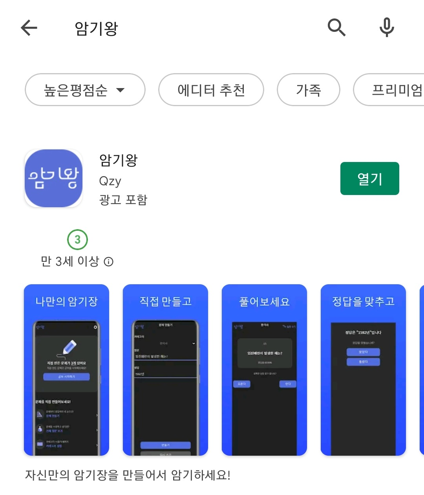
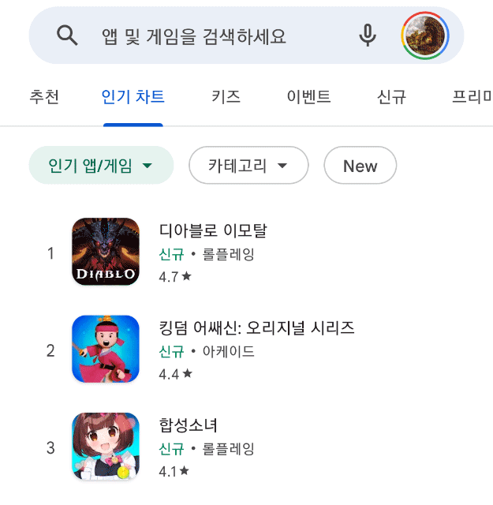
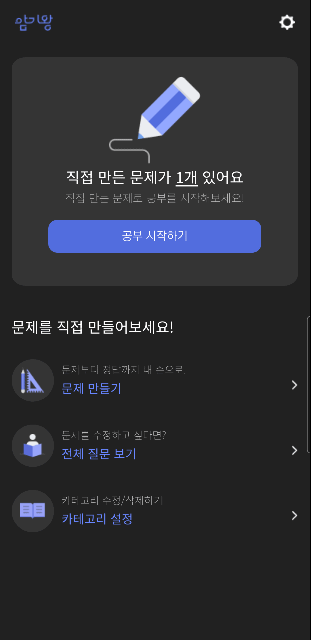
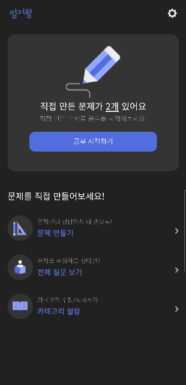

# Flashcard_App

## :computer: 프로젝트 개요

> 직접 문제와 답을 만들어서 공부하는 암기 앱

이름 : 암기왕  
기간 : 2022.05.19(목) - 2022.05.30(화)  
인원 : 1인

프로젝트 시작 이유 : 평소 암기장이 필요하다고 생각했었는데, 하이브리드 앱 만들기 수업을 들은 김에 제작  

### :books: 주 라이브러리, 프레임워크

|이름|사용 이유|비고|
|--|--|--|
|jQuery 2.2.4 (Google CDN)|jQuery 라이브러리를 사용할 경우 단기간에 웹 페이지 제작 가능, jQuery Mobile를 사용하려면 필수적으로 필요한 라이브러리| jQuery Mobile과 호환이 되면서, 보안 취약점이 없는 버전이 2.xx 버전 |
|jQuery Mobile 1.4.5| 단기간에 반응형, 모바일 웹 사이트를 제작할 수 있음 |가장 최신 버전 (2014년 10월)|
|cordova| 간단한 명령어 몇 줄로 앱 빌드(.apk, .aab) 가능 ||
|Web SQL| 로컬 데이터베이스를 사용할 경우, 따로 서버를 운영할 필요가 없다 |Web SQL은 IndexedDB의 등장 이후로 사용되지 않음 (deprecated)|

### :warning: 사용한 프레임워크, 플러그인의 문제점

1. 더 이상 업데이트가 되지 않음
   - 보안 취약점 발생
     - 앞으로 취약점이 발견되더라도, 문제를 맡아서 해결할 사람이 없음
   - 기술 부채 발생
     - 언젠가는 다른 기술로 대체해야 함
2. jQuery의 느린 속도
   - Google play 사전 테스트 결과, 특정 기기에서 동작에 오랜 시간 걸림
     - jQuery를 사용하지 않아도 되는 코드는 순수 JavaScript 사용
     - JQuery 명령어 사용을 줄이는 방식으로 코드 수정 (예: 변수 사용)
3. 세세한 변경의 까다로움
   - 특정 태그마다 라이브러리 자체적으로 추가되어 있는 클래스가 많아, 변경 하려면 관련된 클래스를 모두 변경해야 한다.

## 개발일지

| 일자       | 내용                          | 상세                                                         |
| ---------- | ----------------------------- | ------------------------------------------------------------ |
| 1일차      | 일정 및 페이지 구조 설계      | 백엔드 기본 기능 -> 프론트 및 디자인 -> 추가 기능 -> 테스트  |
| 2일차      | 기본 기능 구현                | 질문 추가, 추가된 질문 목록 조회, 등록된 질문으로 공부하기 기능 구현, 질문지 셔플 기능 추가 |
| 3일차      | 기본 기능 구현 완료           | 카테고리 추가. 카테고리 및 데이터 추가, 삭제 기능 완료. 정답률 표시. 데이터 초기화 |
| 4일차      | 휴식 및 디자인 협의           | 디자인 시안 결정.                                            |
| 5일차      | 메인페이지 디자인 반영        | 메인페이지 글꼴 제외하고 디자인 반영 완료. 카테고리 메뉴 분리 |
| 6일차      | 추가 , 전체보기 페이지        | 글꼴 추가. 추가, 전체보기 페이지 디자인 작업.                |
| 7일차      | 공부하기 페이지               | 공부 페이지 디자인 반영. 버튼을 포함한 전체적인 디자인 수정. 정답 체크하는 부분 통합 |
| 8일차      | apk 환경 설정, 버그 수정      | apk 배포 환경 설정 (안드로이드 스튜디오, cordova, node 등), 버튼 위치 수정, 정답률 정확도 향상 |
| 9일차      | 구글 플레이 업로드, 버그 수정 | 구글 플레이 업로드, 취약한 라이브러리 업데이트, 메인 화면 버튼 길이 버그 수정 |
| 10, 11일차 | 휴식                          |                                                              |
| 12일차     | 메인페이지, 공부 페이지       | 메인 페이지 버튼 사라지는 문제 수정, 공부 카테고리 선택 문제 해결,버전 출력하는 화면 추가, 카테고리 입력 데이터 남아있는 문제 해결 |

### 설치 및 실행

#### 설치

Google Play Store 검색, 혹은 프로모션 코드 사용

    
    

    
무료 프로모션 코드(100개, 06.31까지 유효)

    502CQSTZXTQ9Y28UMF3NAP9   
FXNDPZXQHR1MZS7UDCZWT2V   
G8TC5DNUR1Y934V33WK97U0   
HF94S00K72TPJFLFLW183UA   
55T991NYSPQRF3YB3EHFC18   
K1Y7U0DHTBBQ2C8J9418PND   
LGAVXAL6T23FZN2WPK5PPGZ   
1HMVDUFNXBV7NNVQEPR488J   
2D5JR0CJF2FRRK1BW6LM8LY   
16NEQP6CFL9ZAXQNVDVFD4S   
KN4BRKADNV5NA9GVQ5BDNEZ   
BWWEK5TC1EV0Q5Q69SYJL8R   
P5543DWF2L3MTUPYD5B6J5D   
9UY026UV2GM3079JGG87S7M   
4CMK8Y5T1HRMGN6Z752NW31   
F79QAE2HPT1VJ80ZSL00CYA   
C58A1MC19ZMFSQW6VKBTEN9   
PEYLV6FPT7BKEQFRLPT761W   
TWD98DTG8KDS1YJYYM057VF   
2WA0MWRMPT76FHEZYK3GMEQ   
1ZG7PN1LP4CKJGNRQLE7WEF   
RELEGAAMRYPEZY528JMMC53   
9ACSB9MUU7GBFE7BEGL4LF9   
JX0D7NBZQYHFB1T20XWMELY   
EMFC610PRPG1U0PC1N2YCBW   
FQ1ZNFQMAB0EW6V9T7UJXPX   
RSWW6L98RKWMRTZ79G5XS0P   
NZNFEFC2GYGEN1BT44M7XHQ   
X3WXVHR8XVMRBVRGQ0YVX0X   
ZQ0A3MKVX7DU41N20TARX1L   
YBEFND0R2RYS9LSFJEDUBJQ   
KKWQ27T465GH6LJQ1HU8PWJ   
1K9E7JF0NBWNVBX8AKE3U6Q   
8RQ10993U6ZXE7U858J7D6A   
7DNEVY1MFDKC37PKPP233XV   
43YE8X25NPHHJT1C2QHRMP4     
EY4GRRYBL5TZWMJM4XS9GKU   
DAJRYFJZPLN02867P7ER3XE   
ZN58AGG6FB0414DEFHCR2TH   
1QAM1TKEBGGWE01S3TR61GM   
DX1DRLEWTU7Y8YHRC79NATP   
UQH3RWMH7ME6WPJDTA8AYZJ   	
0UQWFK8R02BR1TNENSLCV0R   
35QLH4DA0BU3926L7NECCWE   
9JJ306ZN8AC981GK7XDXXGW   
PYUGCASEK8UW5UVM1S49TN5   
CQX7FZ4L276CW27G2AMQTCW   
X2TADQK0DSS9FEWSBU05MSK   
GTX6D8SEZFT7Z5VH3N02SNR   
TB82KS7V2BMEFPEYYTMJPKS   
5DGS4B0WWDY8BB8S7UYERT3   
M8U3F3DKG9KXPZ3UE8Z3GG9   
7N3ZYYZ2VHFK9XFJDTMTU38   
3E3FKAZY6TY8NNRGE83GZQ6   
XKPEBLUGTS6H8MPK62249TY   
4WE4U3MQU69T6530FMAFBJS   
QJE00G9JHCYX89EBNUNVWC2   
NERLVEF9TD7M02M6A82HRSV   
Q7BTNELN4740VCMU7YPUMP2   
P5RFKVFRRZ1C72L5G7KCFLE   
QZGEBEAAK2MDHXDG94E6LPD   
N984YMJ4CC6RDK605WZ2Y6G   
QKN778D30Z4CL4GVAM1WMHN   
5TZ5N7H2EEV3PZ5SYKEZ973   
ZBVU4H3WHX6G62K2CESVFKX   
VDLCAF32SWMKDGTFXA9ALCJ   
NWCPCEQS3DYZ41AUF365H4M   
ZXEG3KGWWMN9L7G2WMEEZ59   
0AHD3HKHQEKZHFMFXYZBF9X   
1B47VXFH2WTXVAV8Z2DVR6H   
F756XFX0J93BM42SSRRRA8A   
D7H0186TPPTN9BCQNT34VS8   
6YFD0TNHN77QR6CEHFQ6L9T   
UVVFZ6C7ET58MR6NZLELK6J   
A3UVHQSFZ3Y1JYD14Y9AHNQ   
VHK0WJ04BMUXNDPUUBBFSBX   
8KCRTSJUZ2PV6Z9S0TZVP3G   
Q9VGN0JC5ZVG058L89S9FQU   
DV6R44UW143XVETQ7Q6KZBN   
9U75FEVT8U8RYM30FKVR7M2   
DM1AABBN8GWD40FYQW5V8XV   
A7PNBWJK0HN4QKNY5LK69U5   
DFNWX9JQ2RRV274WLNYV3X2   
HPA10ZU809LFUT0CAX5KHZ6   
4X6HBMKPS4HTUFT0GH8A45N   
WWWXFET48HN6CP5Q39B01GK   
S0V25XAW7KGK9UA26SJKK93   
FG8XKJEXS8XPEBTGJEVL9P6   
W5LUN7PQ1RQQEBW6SUTHPR8   
R9LEY4F7BN4XWAKT0S4TVQK   
9FUEBVH0000Y7267G66SC93   
4867KBMEPH1KFF8A7NN4WQV   
XBX2STYLCT6WUF4URRRJ9QC   
NEF8CCEE1CHPAW17ZSQ57PW   
6SJVKX1UT21NHT54L4MRJ5P   
CXH1CMM0B6EFK7PKSHLW1R7   
R8G3RX2EPRQ4KL644QV7C2L   
1QV7LFJ79W7LZZCZ3B7RUC6   
U5H4RMSJ0H19DR63HHM6R6Y   
G4R81Q61YDNENFPVANNB3N8   
LXSDCQPKR42BEG46A25KZVH   

#### 문제 만들기 & 공부하기

	
    

  

